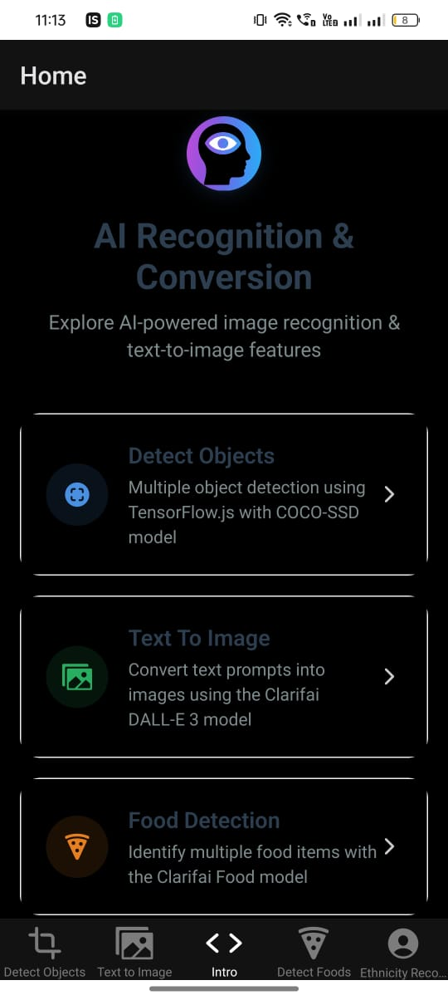
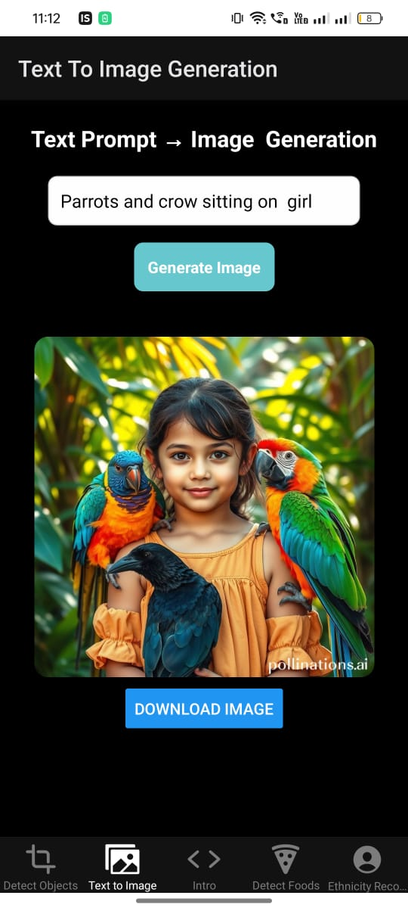
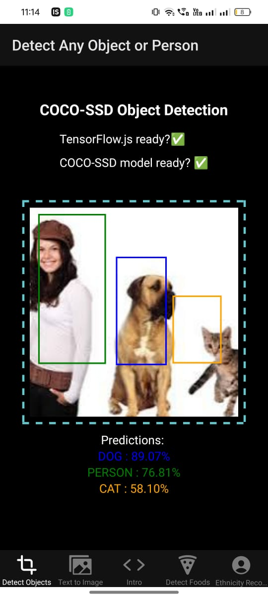
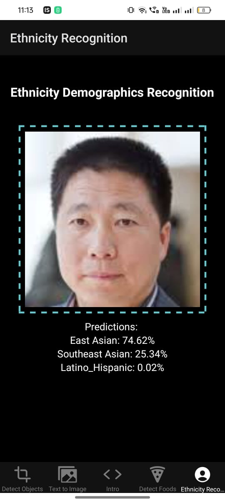
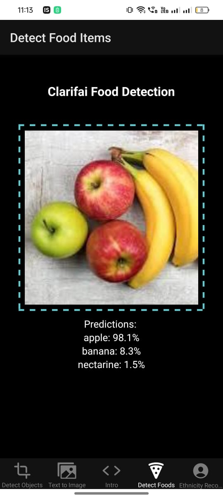

# 🤖 Recognition App

An **AI-powered image recognition & conversion app** built with **Expo + React Native**.  
It demonstrates deep learning models for **object detection**, **food recognition**, **text-to-image conversion**, and **multicultural appearance classification**.

---
## Screenshots:

    


## 📱 Features

- **Detect Objects**  
  Uses TensorFlow.js with COCO-SSD for real-time object detection.

- **Text To Image**  
  Converts text prompts into images using Clarifai DALL-E 3 model.

- **Food Detection**  
  Identifies multiple food items using Clarifai Food model.

- **Appearance Classifier**  
  Classifies a face into multicultural groups (White, Latino, Middle Eastern, etc).

---

## 🚀 Tech Stack

- **Frontend:** React Native + Expo  
- **AI Models:** TensorFlow.js, Clarifai models  
- **Navigation:** React Navigation  
- **Storage:** AsyncStorage  
- **Other:** Expo Camera, Expo Image Picker, Expo Media Library  

---

## 🛠 Installation

### 1️⃣ Clone the repo
```bash
git clone https://github.com/yourusername/recognition-app.git
cd recognition-app
```

### Start development server

```bash 
yarn start
```


## Dependencies

### Key dependencies used in the project:

```bash
expo ^53.0.0

react 19.0.0

react-native 0.79.5

@tensorflow/tfjs ^4.0.0

@tensorflow-models/coco-ssd ^2.1.0

expo-camera, expo-image-picker, expo-media-library

@react-navigation/native ^6.1.6

@expo/vector-icons ^14.1.0
```
